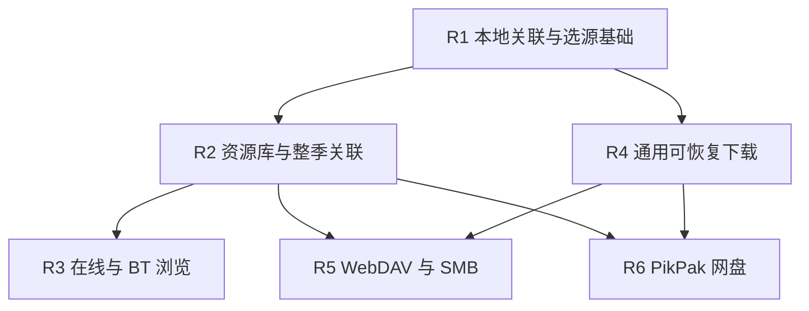

# 个人资源库与通用来源接入实施方案

状态：方案定稿（2026-09-25）。本文是实现规格与交付计划，不表示功能已经上线。

目标平台：Windows、Android 手机/平板。其他平台保持编译兼容，并明确报告平台不支持的能力。

## 1. 交付目标

用户可以从番剧或自己的视频出发，浏览来源、确认番剧与剧集的对应关系，然后使用统一的选源、播放、弹幕、进度恢复和下载流程。

首批来源：

- 本地文件、目录。
- WebDAV、SMB。
- 已有 Selector 网站源、RSS/Mikan/Dmhy 等 BT 源的手动搜索、浏览与关联。
- PikPak 网盘中的已有文件，复用现有 SDK 和单账号会话。

约束：

- 播放前必须确定番剧和剧集；没有关联的文件可浏览，不进入独立播放器。
- 资源库、连接配置和关联关系保存在本机；沿用现有观看进度同步。
- 播放位置和恢复行为沿用现有实现，不建立视频版本级进度。
- 用户文件仅被引用和读取；移除来源、索引或关联不删除原文件。
- 远程视频支持下载到 Ani 管理的存储，作为独立后续交付；本地文件不重复下载。
- 支持一集多个资源，以及合集中的多个文件对应多集；不支持视频内时间段拆集或多个文件拼成一集。
- FTP、OpenList 专用 API、其他网盘、多 PikPak 账号、Jellyfin/Emby 浏览扩展、跨设备资源库同步、后台常驻扫描不在本次交付范围。

相关需求：[3379](https://github.com/open-ani/animeko/issues/3379)、[3440](https://github.com/open-ani/animeko/issues/3440)、[336](https://github.com/open-ani/animeko/issues/336)、[1888](https://github.com/open-ani/animeko/issues/1888)、[2313](https://github.com/open-ani/animeko/issues/2313)、[2107](https://github.com/open-ani/animeko/issues/2107)、[2308](https://github.com/open-ani/animeko/issues/2308)。

## 2. 用户入口与流程

主导航使用“资源”，内部包含：

| 页面 | 内容与操作 |
| --- | --- |
| 我的资源 | 按番剧展示已关联资源；待关联文件；重新定位、修改关联、移除关联。 |
| 来源 | 已有数据源与用户连接的位置；添加、浏览、源内搜索、扫描指定目录、连接状态。 |
| 下载 | 复用现有下载页面及管理能力。 |

来源页复用数据源实例仓库与启用状态，设置页仍承担配置、订阅和全局选源偏好；两处不能维护独立的来源列表。

### 2.1 从番剧出发

- 番剧详情的剧集区域提供“关联资源”，预填当前番剧，进入来源选择与批量关联。
- 播放页提供“选择视频”，包含现有候选和“选择其他视频”。后者进入本地文件选择或通用来源浏览，并携带当前剧集。
- 用户确认“用于当前集”后，持久保存关联，将候选交给现有 `MediaSelector.select`，正常记住用户偏好。
- 桌面拖入视频与选择本地文件共用提交过程。多文件/目录进入批量对应预览；单个文件可以直接用于当前集，并提供修改关联入口。
- 普通自动搜索候选中的切源沿用现有行为，不把所有点过的候选自动收录到资源库。

### 2.2 从资源出发

1. 浏览来源或选择文件/目录。
2. 使用现有文件名解析器生成候选番剧、集号、字幕、分辨率等建议。
3. 复用现有条目搜索，选择番剧；已有明确规则时预填建议。
4. 展示“视频 → 番剧/剧集”对应表，允许批量按顺序对应、跨季拆分、单项修正和忽略。
5. 用户确认后原子提交关联，确保所需条目/剧集信息已缓存；可立即播放或返回资源库。

自动识别结果与用户确认分开。首次模糊识别不静默提交；无法判断、冲突和被忽略的项有可见状态。手工修正不被后续扫描覆盖。

### 2.3 选源行为

- 所有来源以同级 `MediaSource` 实例进入现有 fetch/select/resolve 管线。
- 全局类型偏好和来源排序、番剧内用户选择记忆、切集优先、失败回退适用于新增来源。
- 关联负责纠正归属，不带“已关联必胜”排序，也不隐式修改全局偏好。
- 仅确认关联但未播放时，不写播放偏好；手动选择才写，自动 fallback 不写。
- 故障采用现有失败候选排除、延迟和并发保护，允许回退其他来源。临时不可访问不删除资源关联。
- 播放开始后到达的后台扫描或搜索结果不能抢占用户已经选定的视频。

## 3. 代码边界与复用

| 层 | 职责与现有基础 |
| --- | --- |
| `datasource/api` | 来源接口、浏览节点、长期资源引用、显式合集文件选择；保留 `MediaSource.fetch` 的条目级查询契约。 |
| 来源实现 | 列目录、搜索、资源标识、鉴权、访问能力；Selector/RSS/Mikan/Dmhy/PikPak 分别复用已有实现。 |
| `app-data` 仓库 | 来源实例复用现有仓库；新增索引、扫描根和关联存储；条目/剧集缓存复用现有仓库。 |
| `app-data` 用例 | 扫描、生成匹配建议、确认关联、关联转候选、重新定位。 |
| 现有选择器与播放器 | 过滤/排序/记忆/fallback、MediaResolver、MediaDataProvider、现有进度恢复。 |
| 资源 UI 模块 | 资源主页面、来源浏览、单集选择、批量对应预览；不实现网络协议或匹配算法。 |
| 现有下载体系 | 下载任务、状态、暂停/恢复/删除、缓存存储；通过能力接口访问资源。 |

本地/文件服务/网盘来源的 `fetch` 从已确认关联中产出该条目的资源，不在每次开播时递归扫描目录。已有在线/BT 来源保留自动查询，合并该来源的显式关联并按稳定资源身份去重。

关联提交后失效相关条目/来源的查询缓存，并更新当前条目会话。手动指定结果即刻可选择，切集可以复用新关联；不要求退出页面或重启应用。

### 3.1 浏览能力

在 `MediaSource` 上提供可选的浏览能力接口。能力检查明确区分“不支持”和“支持但没有结果”。现有网站浏览 API 由适配器复用，不要求文件服务伪造网站条目。

浏览契约包含：

- `capabilities`：根目录浏览、搜索、分页、容器展开等支持状态。
- `list(containerRef, pageToken)`：按来源原有结构列节点。
- `search(keyword, scope, pageToken)`：用户关键字原样进入人工搜索；搜索范围由来源声明。
- 节点包含稳定 ID、标题、可选封面/元数据、节点类型、是否可展开/可播放。
- 容器可表示文件夹、网站条目、播放列表、BT 合集；UI 根据节点能力展示操作。
- 取消、超时、鉴权失败、网络失败、不存在有独立结果；不能全部表现为空列表。

网站线路可能同名，稳定节点身份不能只使用线路名。BT 搜索直接列单集/合集发布项，打开合集才请求文件列表。只浏览 BT 元信息不应主动开始视频文件下载；离开或取消必须释放浏览会话。

### 3.2 长期资源引用

资源引用与当次可播放 URL 分离：

| 来源 | 长期身份/定位信息 |
| --- | --- |
| Windows 本地 | 来源实例、根标识、相对路径；单独选择文件可持有绝对路径。 |
| Android 本地 | 来源实例、持久授权的 document/tree URI 与文档标识。不得将 `content://` 当作磁盘路径。 |
| WebDAV | 来源实例、规范化的服务端相对路径；ETag/长度等用于变化检测。 |
| SMB | 来源实例、共享目录与相对路径；文件属性用于变化检测。 |
| PikPak | 来源实例、账号作用域和 `fileId`；下载 URL 在使用时解析。 |
| 网站 | 来源实例、稳定条目/剧集引用；沿用现有资源 ID，线路定位允许同名。 |
| BT | 保持原合集资源身份；每集的显式选择另外保存完整 `pathInTorrent`。 |

引用有序列化版本；数据库使用独立稳定记录 ID，使“重新定位”可以更新 locator 而不丢失关联。原位置失效时只标记状态，不按同名文件静默重绑。路径比较遵循各提供方规则，不统一强制小写。

源连接及凭证仍由来源配置/会话层持有；关联记录、节点 ID 和下载身份不包含密码或临时签名 URL。WebDAV/SMB 支持多个连接；PikPak 单账号。零散本地文件归入“本机文件”，已添加目录可拥有独立来源实例，便于复用来源级偏好与排序。

### 3.3 关联存储

新增 Room 表与仓库：长期引用和关联模型在 R1 固定，扫描/索引/建议模型在 R2 固定。

| 记录 | 关键字段/约束 |
| --- | --- |
| `LibraryResource` | 稳定记录 ID、来源实例 ID、provider resource key、版本化引用、展示元数据、最后发现时间、访问状态；来源内身份唯一。 |
| `ResourceEpisodeBinding` | 资源 ID、subjectId、episodeId、可选显式文件选择、确认状态/手工修正信息；同一资源与剧集提交幂等。 |
| `LibraryScanRoot` | 来源实例、根引用、递归范围、刷新时间、扫描状态、匹配规则。 |
| `LibraryMatchSuggestion` | 待确认项、建议条目/剧集、冲突/忽略状态；与已确认绑定分开。 |

关联记录不依赖“已收藏番剧”的级联删除生命周期。资源库收录不自动修改 Bangumi 收藏状态。清理普通缓存、刷新订阅和取消追番不删除用户文件或显式关联。

确认关联时复用现有条目/剧集缓存。缓存清理必须保留已关联资源播放所需的信息；离线加载不能依赖一次成功的在线刷新。移除关联只删除对应记录；删除来源时明确显示受影响的关联数量，保留已有下载副本。

来源暂时不可用时，已保存的引用仍可产出候选，真实访问错误由解析/播放路径处理；源查询完成不代表视频一定能读。这避免把短暂 NAS 断线当作空库。

## 4. 选择器与播放适配

现有 `MediaSourceKind` 只有 WEB/BitTorrent/LocalCache。用户文件不能归为 LocalCache，后者专指下载管理器拥有的缓存。

- 增加面向偏好的本地文件、网络文件、网盘分类。WebDAV/SMB 属于网络文件，PikPak 已有文件属于网盘；PikPak 解析磁链仍属于 BT。
- 首期延续现有“一个首选类型/无偏好”以及来源排序设置，扩展可选分类；不另建任意多级策略编辑器。已保存的 WEB/BT 偏好和无偏好值保留语义。
- 在现有选择状态机内泛化 WEB 专用的首选源记忆、切集等待、失败回退入口；已知关联可直接给出精确结果，网络搜索保留其现有完成/超时机制。
- 新增类型没有候选或失败时不能无限等待，也不能因默认 enum 分支而跳过 fallback。
- 用户明确确认的条目/剧集关系是身份匹配事实，避免再次因原始标题猜测或 BT 单集隐藏规则将其误判为不属于当前集；仍应用适用的观看偏好与普通排序。
- 文件夹路径不得写入字幕组/线路名称偏好。来源 ID 与现有解析得到的字幕组、分辨率等偏好继续各司其职。
- 正确填写 `episodeRange`，不使用本地拖拽的空范围来长期承载关联资源。
- 所有 UI exhaustive 分支和其他平台实现随类型扩展保持兼容。

### 4.1 BT 显式文件选择

在线播放、下载创建、下载恢复、PikPak 磁链加速都优先使用用户确认的完整内部文件路径。路径找不到时报告具体错误，不重新猜另一个视频。

合集的 `Media.mediaId`、种子会话、物理存储分组保持共享；显式文件选择位于每集关联/解析上下文。不得把文件路径拼入合集 ID 导致每集重复下载和错误清理。

同一集改选同一合集里的文件时，关联可以更新，已下载文件不自动删除或替换。若现有下载任务唯一键冲突，明确提示先处理旧任务，不能把旧文件下载当作新选择的成功结果。首期不扩展为同一合集同一集的多个并行下载任务。

### 4.2 Android 和离线播放

- 系统文件/目录选择保存持久 URI 授权；重启后恢复，授权撤销时支持重新选择并重绑。
- 本地 URI、SMB 随机读取通过现有 `MediaDataProvider`/播放器输入抽象接入，验证 seek、释放句柄和大文件；不能要求用户先复制完整视频到缓存目录。
- 已关联条目与目标剧集缓存完整时，断网/在线刷新失败不能阻塞信息 bundle、选源和播放。
- 首次关联需要可取得条目和剧集信息；不提供自建番剧。离线读取本机或局域网资源不要求在线弹幕可用。
- 播放历史、自动恢复位置、观看状态保存/同步沿用现有代码，不引入版本级记录。

## 5. 扫描与识别

- 连接来源后按需浏览授权范围，只有“加入资源库”的根目录参与递归扫描。
- 初次添加立即扫描；进入资源库时根据过期状态刷新，也可手动刷新。应用退出后不运行常驻任务。
- 按分页/批次提交索引，后台执行、可取消；多个相同根的刷新合并，过期扫描不得覆盖较新的手工修正。
- 失败/取消的扫描不能将未遍历项标为删除；完整成功扫描才能判定某根下的已知文件缺失。
- 缺失项保留关联并标记不可用；一个来源故障不阻塞其他来源和资源库已有内容。
- 复用 `RawTitleParser`/LabelFirst、现有集号匹配与 `SubjectSearchRepository`；不另写文件名解析引擎。
- 当前解析器“匹配失败选第一个视频”的播放兜底不能用于自动确认关联。
- 首次归属由用户确认；新增文件仅在已确认规则唯一命中且无冲突时自动归入，否则生成建议。
- 文件、文件夹名和集号只产生建议；SP/OVA、连续集号、多季度、同集不同版本在预览中可修正。
- 同目录字幕匹配和手动选字幕复用现有 extraFiles/字幕管线；不能把字幕错误识别为剧集。
- 网站和 BT 源按需搜索/展开，不扫描整个站点；远程文件服务没有原生搜索时，清楚标明搜索限于已索引内容。

## 6. 来源无关的下载能力

下载服务只依赖能力接口。来源实现或其适配对象提供下载能力，按长期资源引用准备本次传输；品牌、账号、文件协议的细节不进入任务编排。

### 6.1 能力契约

概念接口为 `DownloadCapability.prepare(resourceRef, episodeContext, explicitSelection)`。`episodeContext` 提供目标条目/剧集 ID、标题、ep/sort 等现有自动选集所需信息，并随下载记录可恢复。显式文件路径优先；没有显式选择的已有 BT 候选继续使用现有集号识别。资源引用与显式文件选择契约在 R1 固定，下载接口名、DTO 与模块位置在 R4 固定，源实现持有鉴权与解析逻辑。返回下列通用访问形式：

| 访问形式 | 承载内容 | 执行层 |
| --- | --- | --- |
| HTTP 文件/HLS | URL、headers、有效期、内容身份、通用并发/重试选项；HLS 保留播放列表/分段语义。 | 现有 HTTP/HLS 下载引擎。 |
| 随机读取字节 | 长度、内容身份、按 offset 打开的可关闭 reader。 | 通用字节复制缓存引擎，消费 SMB 等能力。 |
| Torrent | 种子/磁链、可选内部文件路径。 | 现有 BT 下载引擎与存储。 |

任务 ID、生命周期、下载列表、暂停/恢复/删除、持久化仍由现有 DownloadManager/MediaCache/Storage 管理。能力注册与解析按来源实例查找，Manager 不按 PikPak/WebDAV/SMB 名称分支；传输引擎只区分通用访问形式。

当前 DownloadManager 对 BT→WebM3u 的优先判断，以及 HttpMediaCacheEngine 对 PikPak 配置、并发数和 headers 的读取，应归入能力准备/解析层。共享账号的网盘读取与磁链加速可返回相同 HTTP 能力，任务服务无需了解其差别。

### 6.2 可恢复性

- 下载记录持久化长期引用及显式文件选择；瞬时 URL 不是唯一恢复依据。
- 已有下载记录缺少新增引用字段时，从保存的 origin Media 与现有剧集元数据构造兼容请求；不能要求旧任务重新关联才能恢复。
- 开始、恢复及可恢复的鉴权/过期失败时，通过能力接口获取访问请求；复用当前 task ID、已下载部分和通用下载设置。
- 给现有 HTTP downloader 补充受控的请求刷新入口。不能依赖重复调用 `downloadWithId` 替换 URL，因为当前同 ID 调用直接返回已有任务。
- 刷新 URL 后校验内容身份/长度/可用 validator；无法安全确认同一内容时停止续传并提示重新下载，禁止拼接不同文件。
- HLS 同时处理 playlist 和 segment URL 的恢复与身份校验，不只刷新主 URL。
- 字节读取下载支持恢复 offset、取消和句柄释放；网络错误由任务状态呈现，重试次数有界。
- 新来源下载写入 Ani 管理目录，删除下载只删除该副本；原文件、网盘已有文件和其他剧集共享的种子内容遵守现有引用关系。
- 完整下载之后即使来源掉线，仍能通过现有 LocalCache 来源播放。

## 7. PikPak 复用范围

- 使用当前 `pikpak-kotlin:0.4.3` 的列表/分页/搜索/文件详情能力；以小验证确认参数语义和搜索覆盖范围。
- 将账号会话与 client 创建提取为可共享组件，网盘来源和离线加速共用单账号。
- 网盘来源启用与 BT 加速启用独立；关闭加速不影响浏览已有文件。
- 已有文件播放通过 `fileId` 查询详情并获取访问能力，不调用离线引擎的创建任务、工作目录淘汰路径。
- 扫描和浏览为只读操作，下载到本机也不改动网盘原文件。
- 登录失效显示可恢复状态，重新登录后沿用资源引用；账号更换不得把旧账号的 `fileId` 解释成新账号文件。

## 8. 开发工作包、worktree 与 PR 组织

开发暂按 R1–R6 六个工作包组织，用于 subagent 分工、worktree 隔离和阶段验收，不预设对外 PR 数量。每个工作包包含技术验证、迁移、测试、文档和接线；公共依赖就绪后可独立推进。开发完成后根据实际差异规模和维护者审阅方式决定 PR 组织，可以汇总为一个完整 feature PR。

| 工作包 | 交付目标 | 依赖 | 审阅重点与最小验收 |
| --- | --- | --- | --- |
| R1 | **本地视频关联与统一选源基础**：稳定资源引用、最小关联存储与迁移、来源分类/浏览节点契约、选源记忆与 fallback 泛化、Windows/Android 本地单文件来源、播放页选择/拖入并记住关联、已关联剧集离线播放。 | 无 | 一个文件从选择到关联、播放、重进与离线恢复的完整路径；原 WEB/BT 偏好与进度恢复回归；Android 授权持久化。 |
| R2 | **个人资源库与整季关联**：目录浏览、扫描根/索引/识别建议存储、增量扫描、通用浏览 UI、批量对应预览、番剧详情入口、“资源”主导航及三个页签。 | R1 | 目录→识别建议→确认整季→连续播放；扫描取消/失败不误删；人工修正保护；下载页面与来源配置复用；窄/宽屏交互截图。 |
| R3 | **已有在线/BT 源的手动浏览与关联**：Selector、RSS/Mikan/Dmhy 人工搜索和浏览、BT 合集文件列表、显式文件选择贯穿播放及现有缓存路径。 | R2 | 人工搜索不被自动匹配规则吞掉；同名线路/文件与 SP；显式文件优先；多集共享种子及已有下载冲突可见。 |
| R4 | **来源无关的可恢复下载能力**：下载能力接口与路由、旧来源适配、HTTP/HLS 请求刷新恢复、通用随机读取字节缓存引擎。 | R1 | 下载管理不引用来源品牌；旧 HTTP/HLS/BT 下载兼容；用假来源验证字节读取、链接过期续传与内容变化拒绝拼接。现有下载也实际走该接口。 |
| R5 | **WebDAV/SMB 文件服务接入**：连接/鉴权、目录浏览/索引、随机读取播放、下载能力实现及通用 UI 接线。 | R2、R4 | 两种协议共用浏览/关联/下载流程；Windows/Android seek、大文件、特殊路径、断线、重启续传和只读原文件。 |
| R6 | **PikPak 网盘接入**：共享现有单账号会话、已有文件分页/搜索/浏览/关联、播放与下载能力实现。 | R2、R4 | 关闭 BT 加速仍可浏览；fileId 持久化与临时链接刷新；会话恢复、下载续传、账号作用域；网盘浏览不创建或清理远端任务/文件。 |

R1 包含可使用的单文件功能，用于验证公共契约。R2 专注资源库产品流程，R4 专注现有下载体系的扩展；R3、R5、R6 各自包含来源能力注册、UI 接线、测试和文档。工作包完成意味着该范围可在集成分支验证，不自动触发对外创建 PR。

### 8.1 依赖与并行

1. R1 先固定长期引用、最小关联模型和选源接入契约。下游依据已提交的稳定契约开发，不必等待整个上游工作包完成或对外 PR 合入。
2. R2 与 R4 可以并行；R3、R5、R6 可先基于公共契约和夹具开发，最终集成验收仍须满足依赖图。协议调研、测试服务器和样本准备可以提前并行。
3. 一个工作包可再拆成有明确文件边界的 subagent 子任务，例如 R3 的网站/BT、R5 的 WebDAV/SMB；子任务可以使用独立 worktree，不增加对外 PR 数量。并行度受可用 agent 槽位和构建资源约束。
4. 每个 worktree 指定基线提交、负责模块、依赖契约和验收用例。公共接口、数据库版本/schema、DI、导航与文案公共键由主集成者协调，避免多个 agent 并行修改同一公共文件。
5. R3 的 BT 文件选择与 R4 的下载适配共享 R1 的资源引用/剧集上下文/显式文件选择契约；契约调整由主集成者统一提交并通知下游，不各自复制或演化。
6. 主集成者持续将通过对应测试的提交汇总到 feature 集成分支，执行跨工作包验证并处理冲突。可以使用 rebase/cherry-pick 保持提交顺序，不能只在最后拼接未经联调的分支。
7. 编码和针对性测试可以并行；数据库迁移整合、公共接线和全量 Gradle/native 构建集中协调，避免共享资源争用。

### 8.2 提交与最终评审材料

提交按“契约/存储 → 业务与平台适配 → UI/注册 → 验证与文档”组织；行为测试随相应实现提交。技术验证是工作包的准备任务，不单独发布验证 PR。

- R1 聚焦单文件闭环；目录扫描、批量关联和资源页面属于 R2，下载能力及引擎属于 R4，便于分别开发和审阅。
- R2 的存储/扫描、识别、浏览/关联 UI、主导航分别组织提交；R3 的网站/BT、R5 的 WebDAV/SMB 分别组织提交。
- R4 的 HTTP 请求刷新与字节读取缓存引擎分别提供测试夹具，共用下载能力契约。
- 最终可提交一个 feature PR，也可按实际实现边界组合为少量 PR；六个工作包不构成六个 PR 的承诺。
- 单个 feature PR 提供工作包到代码模块/提交的阅读索引、架构说明、迁移/兼容说明和 Windows/Android 验证矩阵，便于维护者分块评审。
- UI 变更提供截图/交互用例；持久化提供迁移用例；协议适配提供分页、seek、断线/重连等证据。真实服务尚未验证的部分明确标记，不用 mock 结果宣称实测。
- 各工作包持续执行针对性测试；集成分支执行公共回归、跨来源测试和编译检查。发布 PR 前完成完整功能接线、文案、当前设计文档及总体检查。

## 9. 验收矩阵

### 必须保留的自动化测试

- 来源契约：无能力/空列表/错误、稳定 ID、分页、取消、手动关键字语义。
- 数据：Room 迁移、关联幂等、跨季/SP、同集多来源、重新定位、账号作用域、订阅刷新不丢用户绑定。
- 扫描：完整成功与失败/取消的缺失判定、重复根/并发刷新、规则唯一命中、手工修正保护。
- 选择器：类型偏好、源顺序、用户选择记忆、切集、关联候选不被身份猜测误排除、失败跨来源回退、自动回退不覆盖用户偏好、异步结果不抢占。
- BT：显式路径优先、同名文件、多集共享种子、删除一集保留其他集、改选文件与已有任务冲突可见。
- 下载：模拟过期签名 URL、鉴权刷新、重启和断点、Range 不支持、内容变化、HLS 分段、字节读取断线/取消。
- 离线：已缓存条目和剧集在刷新失败时可进入；缺少首次关联信息时明确提示；目标 SP 不因展示筛选而无法加载。
- UI：使用 `runAniComposeUiTest` 的合成点击、输入及截图，覆盖资源三页签、来源浏览、批量对应、错误恢复和窄/宽布局。

### 必须补充的真实运行验证

| 场景 | Windows | Android |
| --- | --- | --- |
| 本地文件/目录关联、重启与 seek | 系统选文件和拖入 | 系统 document/tree 授权、进程重启、撤销权限 |
| WebDAV/SMB 浏览与播放 | 测试服务器，含中文/空格/大文件 | 同一数据集、局域网断线、播放器随机读取 |
| PikPak 已有文件 | 显式测试账号，已有文件只读 | 会话恢复和播放链接刷新 |
| BT 合集人工选文件 | 同名不同目录和跨季样本 | 元信息取消、切集、引擎服务生命周期 |
| 下载与离线播放 | 断网/重启续传、来源掉线后播副本 | 应用重启、权限与网络切换、恢复下载 |

Android 系统授权/播放器验证使用仓库 Android UI 技能；公共 UI 优先用可重复的无 OS 输入测试。Windows 原生播放器与系统文件选择验证使用可用的 Windows 验证路径，不能用 macOS 专用工具结果代替。

功能分批完成的定义：

- 本地交付：R1 提供单文件关联与离线播放，R2 提供目录→确认整季→连续播放及资源库页面。
- 已有来源交付：R3 提供在线/BT 搜索和浏览→关联→正常选源/fallback→播放，保持现有下载可用。
- 远程来源交付：R4 提供统一下载能力；R5、R6 分别提供文件服务和 PikPak 的浏览→关联→播放→下载恢复→副本离线播放，各自独立验收。

## 10. 实现前技术门槛

以下属于工程验证任务，不需要额外产品策略；在相应工作包实现前解决并记录证据：

1. SMB 客户端对 Windows JVM/Android 的兼容性、授权方式、大文件随机读取和取消；在 R5 的准备阶段固定依赖与输入适配。
2. PikPak SDK 搜索范围、分页参数和实际返回；只承诺已验证的服务端能力，不伪装为全盘完备搜索。
3. BT 浏览元信息是否触发文件下载、取消是否关闭会话；显式内部路径贯穿原生 BT 与云端加速。
4. HTTP downloader 替换请求时的段状态一致性，以及 HLS 分段身份恢复。
5. 条目缓存过期刷新错误的实际传播、缓存清理与登录切换对已关联离线播放的影响。

遇到服务限制时报告明确的不支持或可恢复错误，不静默改变源类型、绕过关联要求或删除用户资源。
